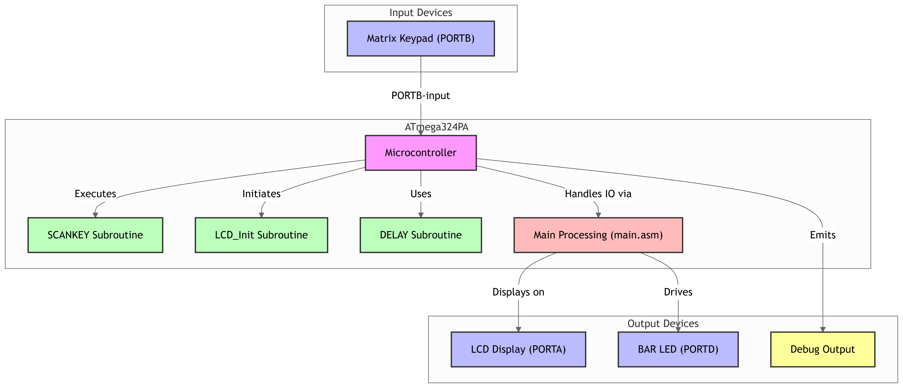

# **ATmega324PA Keypad, LCD & BAR LED Interface**

## **Project Overview**
This project demonstrates how to interface an **ATmega324PA** microcontroller with a **matrix keypad**, **LCD**, and **BAR LED**. The system scans the keypad for key presses and displays the corresponding value on both the **LCD** and **BAR LED**. It also includes a **debouncing** mechanism to ensure stable input detection.

## **Project Diagram**

## **Features**
- **Matrix Keypad**: Scans and returns values corresponding to key presses (0x0 to 0xF).
- **LCD Display**: Displays the key press value.
- **BAR LED**: Outputs the key press value visually on a 7-segment LED bar.
- **Debouncing**: Ensures stable key press detection using a delay mechanism.
  
## **Technology**
- **Microcontroller**: **ATmega324PA**
- **Programming Language**: **AVR Assembly**
- **Components**:
  - **LCD** connected to **PORTA**
  - **Matrix Keypad** connected to **PORTB**
  - **BAR LED** connected to **PORTD**

## **How It Works**
1. The system reads key presses from the **matrix keypad** through **PORTB**.
2. The **SCANKEY** subroutine scans the keypad and returns a value based on the key pressed (0x0 to 0xF).
3. The value is then displayed on the **LCD** and output to the **BAR LED**.
4. **Debouncing** is implemented using a delay after detecting a key press to ensure stable input.

## **Files in the Project**
- **main.asm**: Contains the core program logic for scanning the keypad and displaying the result.
- **LCD_Init.asm**: Subroutine for initializing the LCD display.
- **SCANKEY.asm**: Subroutine for scanning the keypad and detecting key presses.
- **DELAY.asm**: Delay subroutine for debouncing the keypad input.

## **Setup & Usage**
1. **Hardware**:
   - Connect the **LCD** to **PORTA**, the **matrix keypad** to **PORTB**, and the **BAR LED** to **PORTD** on the **ATmega324PA**.
2. **Software**:
   - Upload the **main.asm** file to your **ATmega324PA** microcontroller.
   - Once the program runs, it will display key presses on the **LCD** and **BAR LED**.

## **How to Run the Code**
1. Connect all the hardware components (LCD, Keypad, BAR LED) to the **ATmega324PA**.
2. Compile and upload the assembly code to the microcontroller.
3. Open the program and observe the results on both the **LCD** and **BAR LED** when keys are pressed.

## **Responsibilities**  
- Designed and implemented the system to interface **ATmega324PA** with **keypad**, **LCD**, and **BAR LED**.  
- Developed the **SCANKEY** subroutine for keypad scanning and keypress detection with **debouncing**.  
- Optimized I/O port configuration and tested the system for stable performance.

## **Conclusion**
This project offers a hands-on implementation of a **keypad interface** with **AVR Assembly** programming. It demonstrates key concepts like I/O port configuration, debouncing, and displaying values on an **LCD** and **BAR LED**. The use of **ATmega324PA** ensures efficient resource management for embedded systems.
